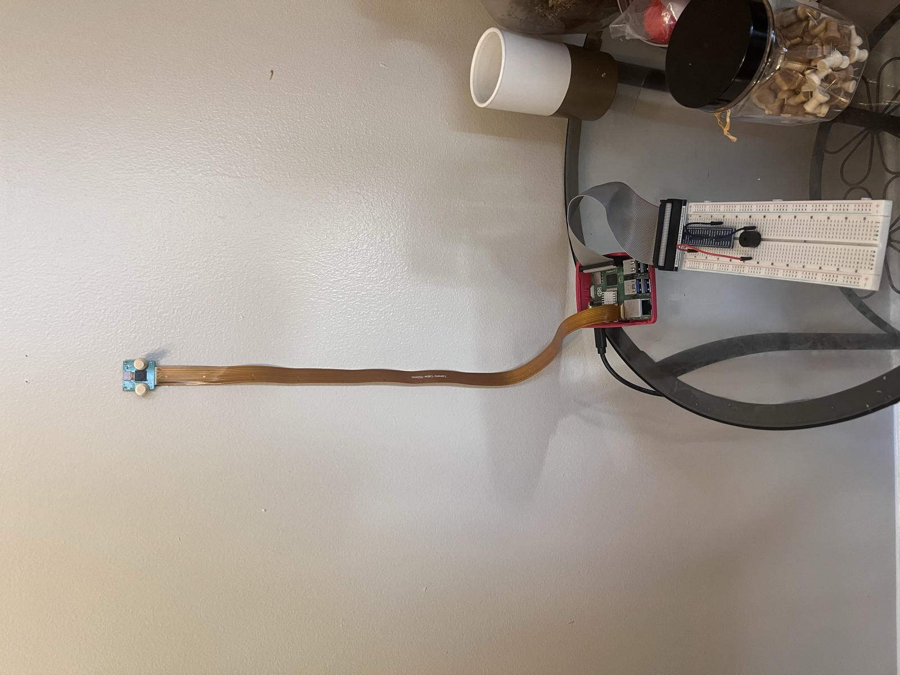

# IoT Ergonomic Posture Monitor

**Aaryans Nepal**

CSC 494 — IoT (Spring 2026) — Final Presentation

---

## The Project in One Minute

A **Raspberry Pi 5** watches you through a Pi Camera, runs MediaPipe Pose ~10 FPS on CPU, scores your posture **0-100** in real time, and **buzzes** when you slouch.

- Runs entirely on-device — no cloud, no GPU
- **Two scoring modes**: self-calibrate (personal baseline) or ergonomics research (literature thresholds)
- Logs every frame to a labeled CSV for later analysis
- Flask MJPEG web UI — open `http://<pi-ip>:5000` on any browser

GitHub: <https://github.com/AaryansNepal/CSC-494_Project>

---

## The Pivot — Why This Isn't Theft Detection

**Original plan (PPP.pdf):** an IoT theft detection system that flagged hand-to-hip concealment in retail stores.

After weeks of prototyping, two problems killed it:

1. **False-positive nightmare** — reaching into your own pocket, adjusting your belt, holding a phone on your hip: all the same geometry as "concealment." No way to tell intent.
2. **No face recognition** — can't tell a shoplifter from an employee restocking shelves. Adding facial recognition felt like overkill for a concept I already doubted.

The **core tech** (MediaPipe Pose on Pi 5) was solid. The **application** was wrong. I kept the stack and pivoted.

---

## Finding the Right Project

Ruled out a bunch of ideas before landing on posture. What finally clicked: **I had the problem myself.**

I sit at a desk for hours, my posture is bad, and every time I *notice* it I straighten up. The entire value prop was: "What if the Pi noticed for me?"

Concrete, personal, testable, no ethical baggage, one user (me) I could iterate on.

---

## What I Built — The Pipeline

```
Camera → MediaPipe Pose (33 skeleton points)
       → 7 key points (nose, ears, eyes, shoulders)
       → 5 weighted metrics
       → Score 0-100
       → State machine (10 s bad → buzzer on, 3 s good → off)
       → Live browser stream with skeleton overlay + score bar
```

---

## The 5 Metrics (and the Z-Axis Lesson)

First attempt used **X/Y coordinates** — score stuck at 0-2 regardless of how much I slouched.

Diagnostic script at 5 timepoints showed slouching is **Z-axis motion** (head moves *toward* the camera), not lateral:

| Metric | Change | Verdict |
|--------|--------|---------|
| `head_forward` (X-based) | **0.003** | Useless |
| `nose_y` (absolute Y) | 0.103 | Significant |
| `nose_z_depth` | 0.062 | Significant |
| `face_size` | **2×** | Clearest signal |

Rebuilt around: `nose_y` (30%) · `nose_z_depth` (25%) · `ear_z_depth` (20%) · `face_size` (15%) · `shoulder_tilt` (10%).

---

## Two Scoring Modes

**1. Self-Calibrate** — 5-second "sit up straight" at startup captures your personal zero-point. Scoring is the delta from *your* baseline.

**2. Ergonomics Research Mode** — absolute thresholds from published literature. No calibration needed.

- Shoulder asymmetry — Raine & Twomey (1997)
- Forward head posture — Yip (2008)
- Cervical load vs forward flexion — Hansraj (2014)

---

## Data Collection Pipeline

Browser shows **5 labeling buttons** below the stream: Good · Slouch · Forward Head · Tilt · Clear.

Every frame writes a row to `data/session_<timestamp>_<mode>.csv`:

- timestamp · mode · label · score · is_bad · all 5 metrics

Result: every demo session produces a **usable labeled dataset**. Opens the door to a classifier later without being the bottleneck now.

---

## Live Demo

See the demo video in the `demo/` folder of the GitHub repo (Google Drive link inside).

The video shows:

- Pi boot + terminal mode picker
- Browser view with skeleton and score bar
- Sit up → green. Slouch → red. Hold → **buzzer fires** after the configured window.
- Sit back up → buzzer silences
- Clicking labels while posing, then Ctrl+C showing the CSV path

---

## My Home Setup



Raspberry Pi 5 + Pi Camera (Rev 1.3) + active buzzer — running live at my desk.

---

## The Hardware Saga — Camera Cables and Prof. Ross

Original plan: **Pi Camera Module 2** on Pi 5.

- Pi 5 CSI connector is smaller than older Pi models → needed a **15-to-22-pin adapter ribbon**
- Bought *multiple* adapters over a few weeks. None worked.
- I assumed the cables were the problem. Kept buying new ones.

**Breakthrough:** sat down with **Prof. Kenneth Ross** in his office. We ruled out every cable, then ruled out the Pi. **The Module 2 camera itself was the issue.**

Swapped to Prof. Ross's **Pi Camera Rev 1.3 (OV5647)** — live feed was up the same day.

**Lesson:** don't debug one variable at a time when you can change the whole component.

---

## Progress Since Sprint 1

Sprint 1 ended with the system running on **phone-recorded video** (camera adapter still broken).

Sprint 2 — what's been added:

- Switched to **Pi Camera Rev 1.3** — first real live camera feed
- **Hardened camera init** — picamera2 falls through to OpenCV, clear error if nothing works
- **Startup mode picker** — self-calibrate or ergonomics research
- **Research-mode scorer** using literature-backed absolute thresholds
- **Per-session CSV pipeline** — every frame logged
- **Labeling UI** in the browser — good / slouch / forward_head / tilt

Commits: <https://github.com/AaryansNepal/CSC-494_Project/commits/main>

---

## What I Learned From Using AI

**Claude, ChatGPT, Copilot** — great coding partners. But the real lesson was different.

**AI models are great "yes men."** They agree with your hypothesis, make you feel like a genius, and always produce a paper or snippet that fits your story.

One prompt — *"this feels like overkill with no real endpoint"* — and the model completely flipped, happily listing every flaw the project had. The flaws hadn't changed. My framing had.

**The rule I keep:** AI confirms the hypothesis you give it. Your job is to challenge it with data. The diagnostic script that exposed the Z-axis insight was me **forcing** the question — the AI never suggested it on its own, because I had never asked the right question.

---

## Issues Encountered and How I Solved Them

- **X/Y metrics stuck at 0-2 / 100** → wrote `diagnose.py` to dump every landmark delta between good/bad frames. Rebuilt around Z-axis.
- **Pi Camera adapter chain broken** → spent weeks assuming cables; Prof. Ross helped isolate the camera itself. Swapped to Rev 1.3.
- **OV5647 orange/warm color cast** → the v1 sensor tuning is less accurate than IMX219. Documented as a known quirk; explored AWB/AE controls.
- **Calibration failing silently** → MediaPipe was returning 0 valid samples because no one was in frame during the 5-second window. Added clearer prompts and terminal guidance.
- **No live camera detected** → `init_camera` used to crash silently; now it prints a troubleshooting checklist (ribbon, `ls /dev/video*`, `libcamera-hello`, `--video` fallback).

---

## Where This Goes — Sports Coaching, Gym / Yoga

The system I built is **general**. Swap the metrics and thresholds, and the same pipeline works for any movement that a coach cares about.

The future version I want to build: a **basketball** (or any suitable sport) variant that sits courtside during practice and gives coaches an objective, per-player read on form — shooting stance, elbow alignment, follow-through, foot positioning.

Watching tutorials can be helpful, but a system that monitors, guides, and gives real-time feedback at low cost is far more impactful.

- Same Pi / MediaPipe stack
- Same state machine
- Different metric set (sport-specific)
- Same CSV pipeline → per-player trend dashboards

---

## Links

- **GitHub (project):** <https://github.com/AaryansNepal/CSC-494_Project>
- **GitHub (Learning with AI):** <https://github.com/AaryansNepal/CSC-494_Learning-with-AI>
- **Demo video:** see `demo/` folder in the project repo
- **Canvas:** CSC 494 Spring 2026 — Aaryans Nepal individual progress page

---

## Thank You

Questions?

*— Aaryans Nepal, CSC 494 — IoT, Spring 2026, Northern Kentucky University*
